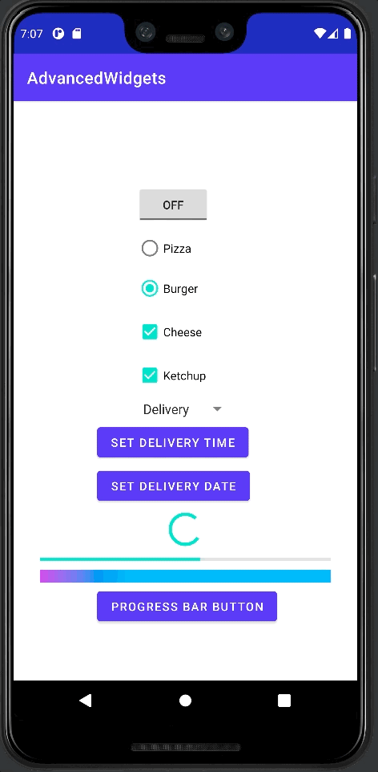

# Advanced Widgets

## Goal

Basic Experiment - Advanced Widgets

## Content
- How to implement the following widgets:
  - Toggle Button
  - Radio Button
  - CheckBox
  - Spinner (Dropdown)
  - Timer Picker
  - Date Picker
  - Progress Bar
      - Indeterminate mode - circular bar
      - Determinate mode - horizontal bar
  - Custom Progress Bar (w/ Gradient)