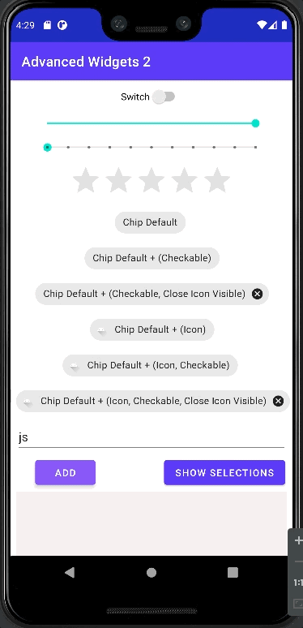

# Advanced Widgets

## Goal

Basic Experiment - Advanced Widgets 2

## Content
- How to implement the following widgets:
  - Switch
  - SeekBar (SlideBar)
  - SeekBar (Discrete)
  - RatingBar
  - Chip
    - Clickable Chip
    - Clickable Chip with x icon
    - Clickable Chip with left icon 
    - Clickable Chip with left and x icon
  - Chip Group
    - Add Chips that are clickable
    - Show selected chips
    - Remove chips