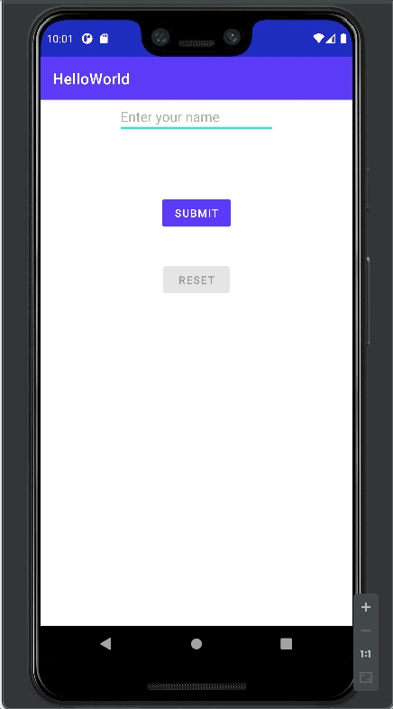

# HelloWorld (Code Challenge)

## Goal

HelloWorld - type your name and show a toast of it using a button

## Content
- Parts of Android Studio
- Folder Structure and contents of an Android Project
- TextView, EditView, Button, Toast widgets
  - attributes
  - .setOnClickListener
  - .addTextChangedListener
    - disabling button based on a condition
  - findViewById
- InputMethodManager
  - dismiss keyboard using .hideSoftInputFromWindow