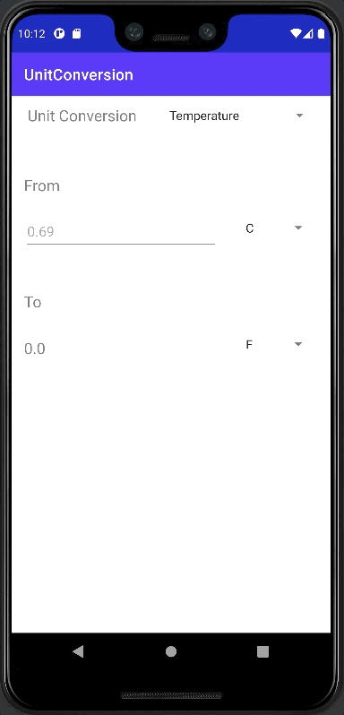

# UnitConversion (Challenge)

## Course Goal

UnitConversion - to convert Kilograms to Pounds only

## Personal Goal
- [To clone my iOS SwiftUI - UnitConversion Challenge Project](https://github.com/ramirezjag00/iOS-Native-Demo/tree/main/Swift%20UI/UnitConversion)
  - Temperature conversion: users choose Celsius, Fahrenheit, or Kelvin.
  - Length conversion: users choose meters, kilometers, feet, yards, or miles.
  - Time conversion: users choose seconds, minutes, hours, or days.
  - Volume conversion: users choose milliliters, liters, cups, pints, or gallons.
  - Mass conversion: g, kg, lb, t

## Content
- ConstraintLayout
- Widgets: TextView, EditView, Spinner, ArrayAdapter, AdapterView
  - attributes
  - findViewById
  - spinner.setOnItemSelectedListener
  - editView.addTextChangedListener
  - adapter.createFromResource
  - adapter.setDropDownViewResource
  - spinner.setAdapter
  - spinner.setSelection
- Resource
  - string-array xml
  - getResources()
  - res.getStringArray(R.array.foo_array)
- Java
  - string, array of string, int, double, functions (void OR w/ return type), private/public functions,
  - .isEmpty(), operators, conditional statements
- How to install: Android Java Library jar file
  - [UnitOf conversion library](https://github.com/digidemic/UnitOf)